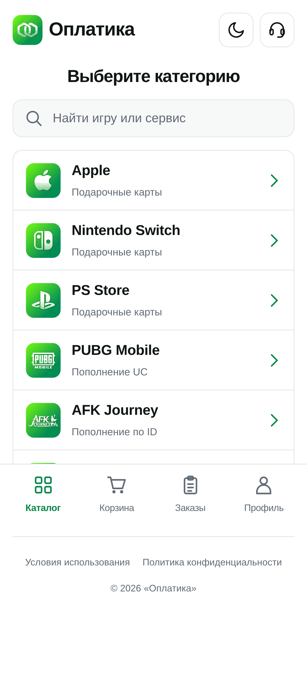
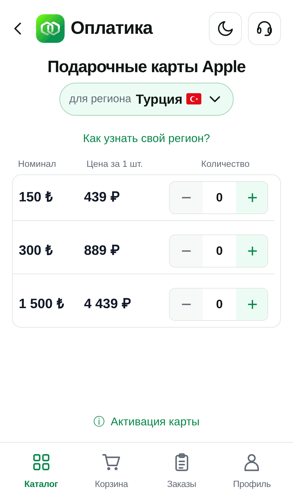
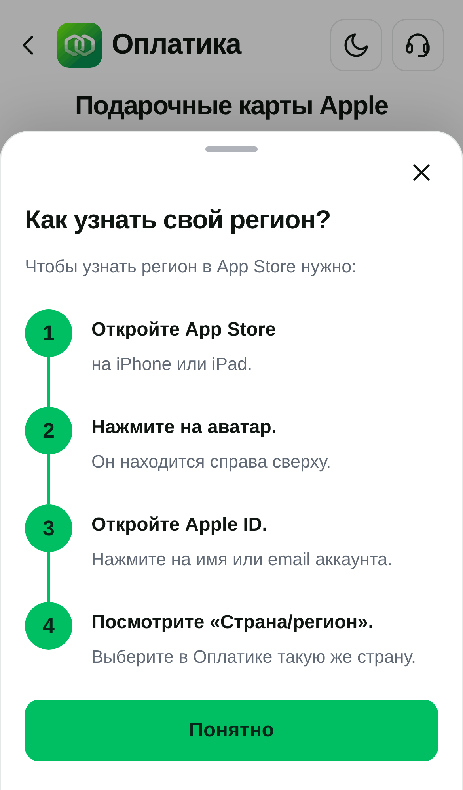
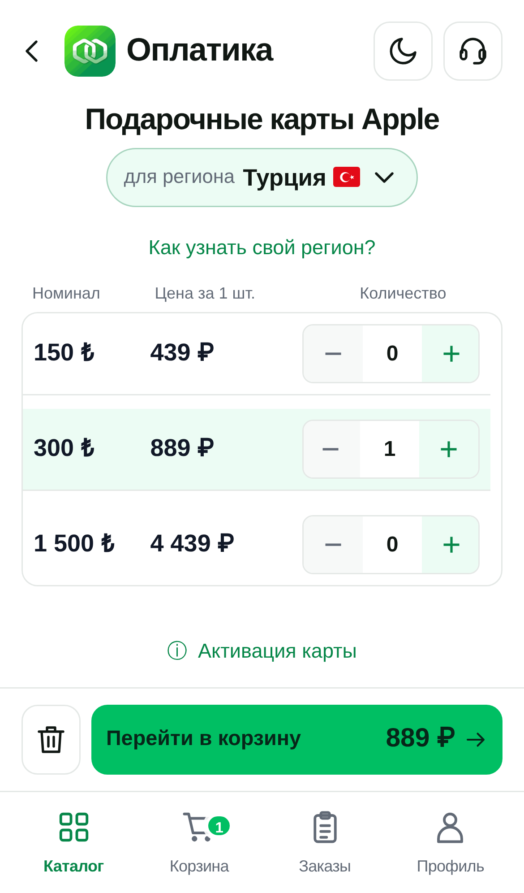
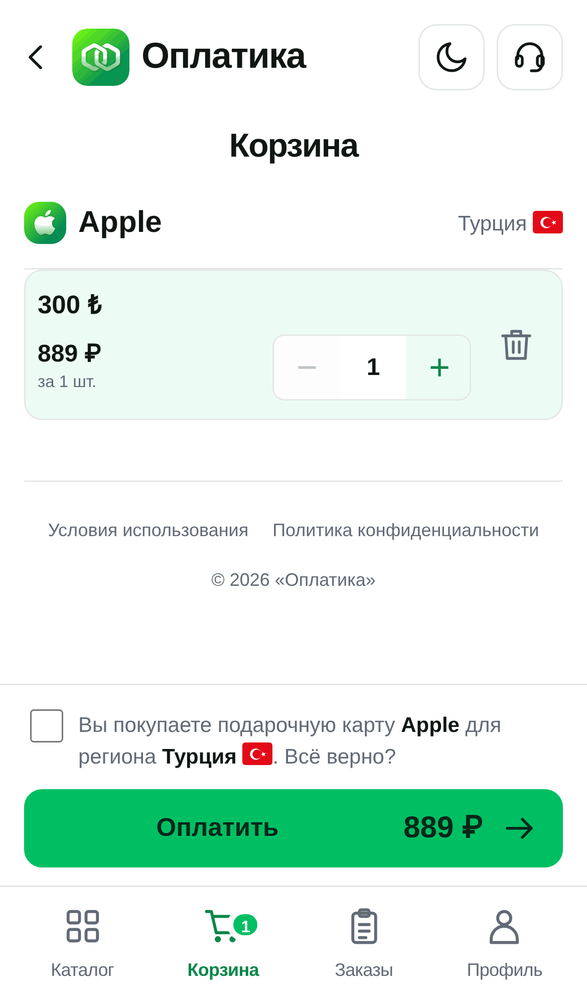
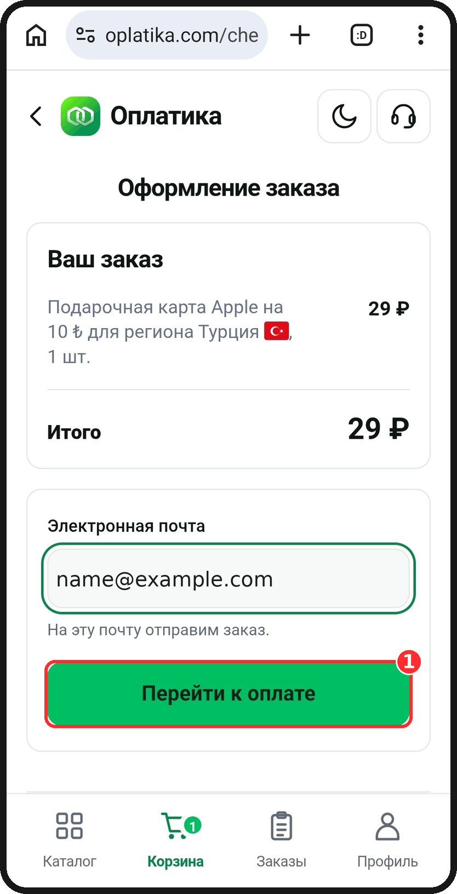
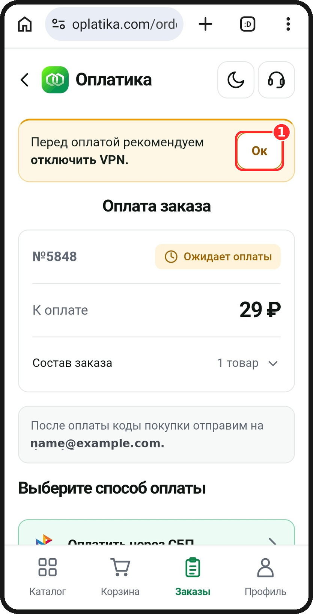
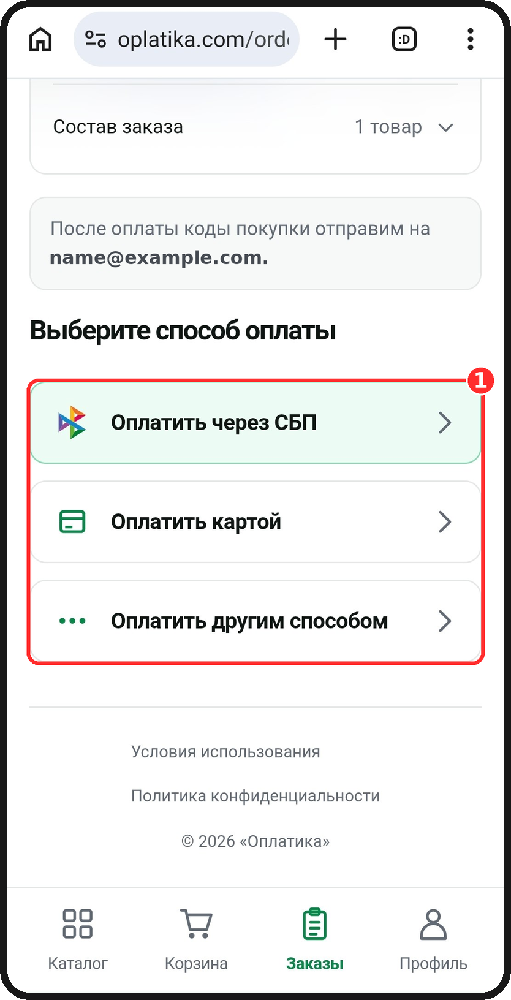
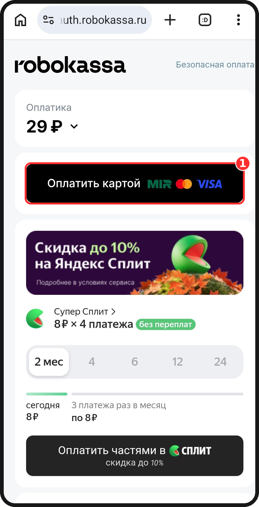
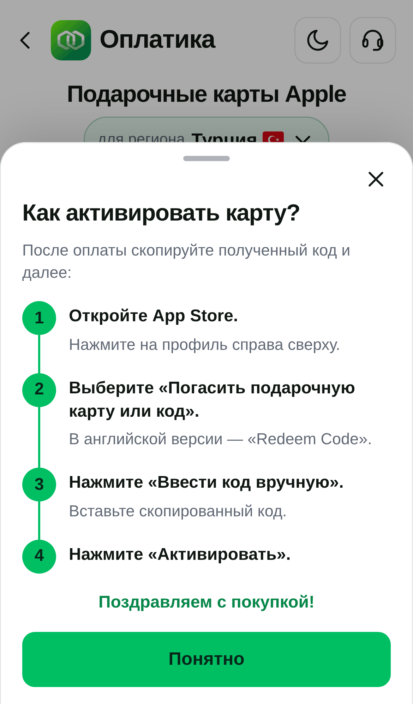

# Как создать турецкий Apple ID на iPhone: пошаговая инструкция

*Лид:* Хотите оформлять подписки (ChatGPT Plus, iCloud+, Apple Music, YouTube Premium, CapCut Pro) по турецким ценам, но не хотите трогать основной аккаунт с фото, заметками и покупками? Создайте отдельный чистый Apple ID сразу с регионом «Турция». Это занимает 10–15 минут. Ниже инструкция от создания аккаунта до пополнения баланса через Оплатику.

**Что понадобится**
- iPhone с актуальной iOS;
- почта, которую вы ещё не использовали для Apple ID (подойдёт новая на Gmail, iCloud или Яндекс);
- номер телефона для подтверждения (подойдёт российский);
- 10–15 минут времени.

---

## Зачем нужен турецкий Apple ID

- Подписки и приложения в турецком регионе часто стоят в 2–3 раза дешевле российских и европейских. Apple сама устанавливает разную ценовую политику по странам, так что это законно.
- Основной аккаунт остаётся нетронутым. Фото, iCloud, заметки, подписки и семейный доступ не затрагиваются.
- Карты российских банков в турецком регионе не работают. Баланс пополняют подарочными картами в турецких лирах (₺), их можно купить в Оплатике.

> **Важно:** не меняйте регион в основном аккаунте. Для этого нужно обнулить баланс, отменить подписки и выйти из семейного доступа. Проще завести отдельный аккаунт.

---

## Часть 1. Создаём турецкий Apple ID

> **Сделайте перед началом:** выходите только из «Контент и покупки», а не из iCloud. Тогда фото и данные основного аккаунта остаются на месте. Подробности в шаге 1.

### Шаг 1. Выйдите из основного аккаунта в App Store
1. Откройте **Настройки** и нажмите на своё имя вверху.
2. Выберите **«Контент и покупки»** (в английской версии Media & Purchases).
3. Нажмите **«Выйти»**. Это не затрагивает iCloud, фото и данные.

*Скриншот: [ТРЕБУЕТСЯ iPhone] Настройки → имя → «Контент и покупки» → «Выйти».*

### Шаг 2. Начните создание нового Apple ID
1. Откройте **App Store** и нажмите на иконку профиля в правом верхнем углу.
2. Нажмите **«Войти»**, затем **«Создать новый Apple ID»**.

*Скриншот: [ТРЕБУЕТСЯ iPhone] App Store → профиль → «Создать новый Apple ID».*

### Шаг 3. Введите почту и пароль
Укажите новую почту, которую вы не использовали для Apple ID, и придумайте пароль. Пароль должен быть не короче 8 символов, с цифрой, заглавной и строчной буквой.

*Скриншот: [ТРЕБУЕТСЯ iPhone] экран «Создать Apple ID» (почту и пароль на скриншоте скройте).*

### Шаг 4. Выберите страну — Турция
Нажмите на строку **«Страна или регион»** и выберите **Турцию (Türkiye)**. Это ключевой шаг: регион аккаунта определяет цены и подписки.

*Скриншот: [ТРЕБУЕТСЯ iPhone] выбор страны, в списке выбрана Türkiye.*

### Шаг 5. Примите условия
Нажмите **«Принять»** (Agree) на экране с условиями Apple.

### Шаг 6. Заполните имя, дату рождения и телефон
- Имя и фамилию можно указать любые. Дата рождения должна показывать, что вам больше 18 лет.
- Укажите номер телефона и получите код подтверждения по SMS. Российский номер подходит.

*Скриншот: [ТРЕБУЕТСЯ iPhone] экран с именем, датой рождения и телефоном (данные скройте).*

### Шаг 7. Выберите способ оплаты — «Нет»
В разделе способа оплаты выберите **«Нет»** (на турецком экране может быть «Yok»). Если «Нет» не видно, то обычно нужно сначала указать адрес.

### Шаг 8. Укажите адрес в Турции
Apple просит турецкий адрес. Подойдёт любой реальный адрес в Стамбуле, например отель, ТЦ или улица из Google или Яндекс.Карт. Нужны:
- улица и номер дома;
- район (например, Beyoğlu);
- город — İstanbul;
- почтовый индекс (для центральных районов Стамбула он начинается на 34, например 34433);
- телефон, тот же что на шаге 6.

*Скриншот: [ТРЕБУЕТСЯ iPhone] форма адреса.*

### Шаг 9. Подтвердите почту
Apple пришлёт код на почту. Введите его, и аккаунт создан. Войдите в App Store с новым Apple ID. Теперь у вас чистый турецкий аккаунт с нулевым балансом.

*Скриншот: [ТРЕБУЕТСЯ iPhone] профиль в App Store: имя нового аккаунта, внизу в «Страна/регион» — Türkiye.*

> **Проверить регион в любой момент:** App Store → профиль → нажмите на имя → строка «Страна/регион».

---

## Часть 2. Пополняем баланс подарочной картой

Российские карты в Турции не работают. Поэтому баланс пополняют подарочными картами Apple в турецких лирах, которые продаются в Оплатике. Берите карту строго для региона **Турция**: карта другой страны на турецкий аккаунт не активируется.

### Шаг 10. Откройте Оплатику и выберите Apple
Откройте сайт [oplatika.com](https://oplatika.com/) на телефоне. В каталоге выберите **Apple (Подарочные карты)**.

### Шаг 11. Убедитесь, что выбран регион «Турция»
Откроется страница «Подарочные карты Apple». Под заголовком должна стоять плашка **«для региона Турция 🇹🇷»**. Регион карты должен совпадать с регионом вашего Apple ID.

Если сомневаетесь, нажмите **«Как узнать свой регион?»**. Сайт покажет короткую подсказку: App Store → профиль → ваше имя → «Страна/регион».

### Шаг 12. Выберите номинал
На момент написания статьи (октябрь 2026) доступны номиналы:

| Номинал | Цена |
|---|---|
| 150 ₺ | 439 ₽ |
| 300 ₺ | 889 ₽ |
| 1 500 ₺ | 4 439 ₽ |

В каталоге бывают и другие номиналы, например 10 ₺ за 29 ₽.

Цены на сайте обновляются, смотрите актуальные перед покупкой. Нажмите **«+»** рядом с нужным номиналом.

> **Совет:** берите карту с небольшим запасом. На подписку и возможные налоги в Турции может понадобиться чуть больше, чем кажется.

### Шаг 13. Перейдите в корзину и подтвердите заказ
Нажмите зелёную кнопку **«Перейти в корзину»** внизу экрана. В корзине проверьте регион и номинал, поставьте галочку **«Вы покупаете подарочную карту Apple для региона Турция. Всё верно?»** и нажмите **«Оплатить»**.

### Шаг 14. Укажите почту и оплатите заказ
1. На экране **«Оформление заказа»** проверьте состав заказа и введите свою электронную почту. На неё придёт код.
2. Нажмите **«Перейти к оплате»**.

3. Откроется страница заказа со статусом **«Ожидает оплаты»**. Сверху сайт напоминает: **перед оплатой рекомендуем отключить VPN**. Отключите его и нажмите «Ок».

4. Прокрутите вниз и выберите **способ оплаты**: СБП, карта или другой способ.

5. Оплатите на странице платёжного сервиса (на скриншоте это Robokassa).

Код придёт на указанную почту примерно через 20–40 секунд. Он также сохранится на вкладке **«Заказы»** внизу, так что его не потеряете.

### Шаг 15. Активируйте код в App Store
Скопируйте код и сделайте на iPhone:
1. Откройте **App Store** и нажмите на профиль справа сверху.
2. Выберите **«Погасить подарочную карту или код»** (Redeem Gift Card or Code).
3. Нажмите **«Ввести код вручную»**.
4. Вставьте скопированный код.
5. Нажмите **«Активировать»**.

Баланс появится мгновенно.

*Скриншот: [ТРЕБУЕТСЯ iPhone] «Погасить подарочную карту или код» → ввод кода → баланс в профиле.*

---

## Часть 3. Покупаем подписку

Откройте нужное приложение (ChatGPT, CapCut, YouTube, Apple Music или iCloud в настройках). Перейдите в раздел подписки и оформите её. Цена будет в лирах, а списание идёт с баланса Apple ID, без банковской карты.

*Скриншот: [ТРЕБУЕТСЯ iPhone] оформление подписки с турецкой ценой.*

---

## Если что-то пошло не так

| Проблема | Что делать |
|---|---|
| Код не активируется, пишет «не соответствует региону» | Регион карты и аккаунта не совпадают. Проверьте регион (шаг 11) и купите карту для нужной страны. |
| В App Store остался российский регион | Вы вошли не в тот аккаунт. Выйдите из «Контента и покупок» и войдите в турецкий. |
| Не создаётся аккаунт: «почта уже используется» | Нужна новая почта, которая ещё не привязана к Apple ID. |
| Не получается выбрать «Нет» в способе оплаты | Выйдите, снова начните регистрацию и сразу выберите страну Турция. У аккаунта с привязанной картой или остатком на балансе такого варианта может не быть. |
| Хотите сменить регион в старом аккаунте, а он не меняется | Мешают остаток на балансе, активные подписки или семейный доступ. Отмените подписки, обнулите баланс (в этом поможет поддержка Apple) или создайте новый аккаунт. |
| Вопрос по заказу в Оплатике | Нажмите на значок наушников в правом верхнем углу сайта. Он открывает поддержку. |

---

## Коротко

1. Выйдите из «Контента и покупок», не из iCloud.
2. Создайте новый Apple ID, регион — Турция, способ оплаты — «Нет», адрес — Стамбул.
3. Купите на [oplatika.com](https://oplatika.com/) подарочную карту Apple для региона Турция.
4. Активируйте код в App Store и оформите подписку по турецким ценам.
